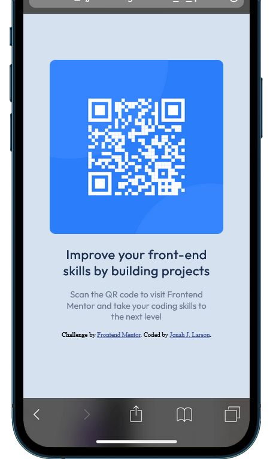
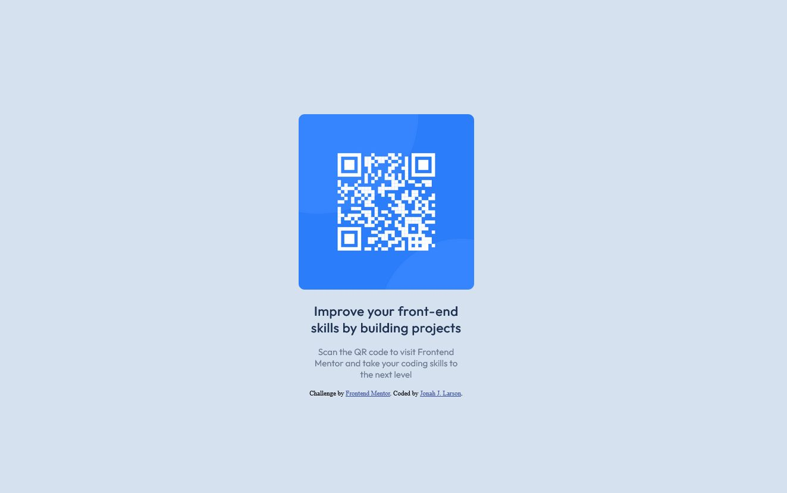

# Frontend Mentor - QR code component solution

This is a solution to the [QR code component challenge on Frontend Mentor](https://www.frontendmentor.io/challenges/qr-code-component-iux_sIO_H). 

## Table of contents

- [Overview](#overview)
  - [Screenshot](#screenshot)
  - [Links](#links)
- [My process](#my-process)
  - [Built with](#built-with)
  - [What I learned](#what-i-learned)
  - [Continued development](#continued-development)
  - [Useful resources](#useful-resources)
- [Author](#author)
- [Acknowledgments](#acknowledgments)

**Note: Delete this note and update the table of contents based on what sections you keep.**

## Overview

### Screenshots 

### Links

- Solution URL: [GitPages URL](https://jjlarson33.github.io/fe_m_qrcode/)

## My process

I started with the mobile aspect and spent a bit of time tinkering with the css, the eyedropper tool from Firefox dev tools was a great help in narrowing down the colors from the examples.
The style guide was helpful but I wanted to try practicing 'eyeballing' it. The desktop media query was a little trickier to figure out with the sizing of the component, but learned a bit about 
css margins.

### Built with

- Semantic HTML5 markup
- CSS custom properties
- Flexbox
- CSS Grid
- Mobile-first workflow

**Note: These are just examples. Delete this note and replace the list above with your own choices**

### What I learned

There's a lot of nuance to how css properties work together and against each other and while this project introduced me to a few, I'm certain there will be more practice necessary to fully understand how CSS can work in a project.

## Author

- Frontend Mentor - [@JJLarson33](https://www.frontendmentor.io/profile/JJLarson33)

